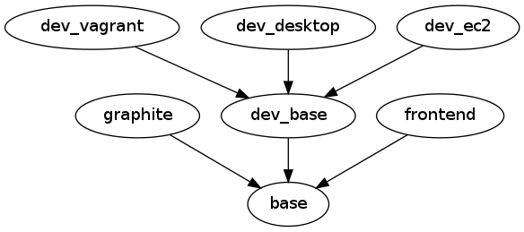
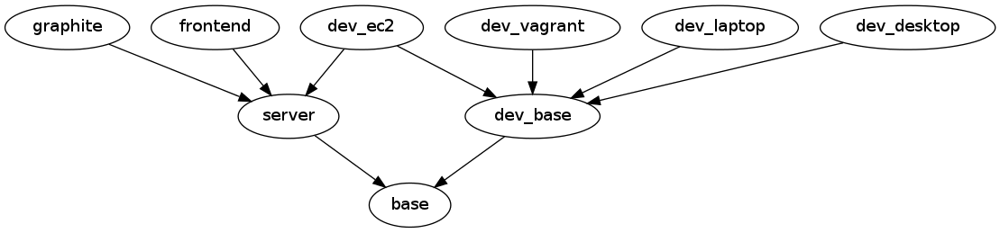

#knife role viz

Generate dot files illustrating your Chef role relationships

##Install
Copy to `~/.chef/plugins/knife/` or similar.

##Usage
`knife role viz | dot -Tpng -o roles.png && display roles.png`

##Examples

